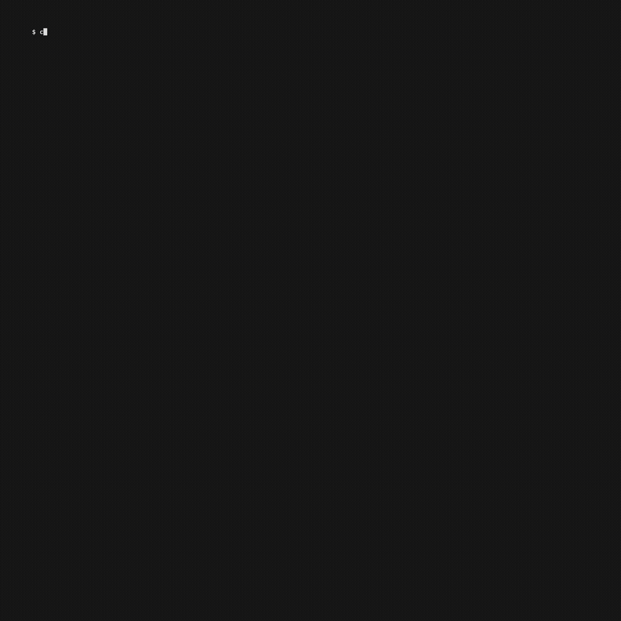

# OrcaCode Review

**[AI code review](https://www.orcarouter.ai/code-review) that catches serious issues before they merge — powered by ****[OrcaRouter](https://www.orcarouter.ai/)****.**

Automatically review every pull request, post findings directly on the affected lines, and block serious issues from merging.

**P0/P1 → ❌ Block** · **Findings → 💬 Comment** · **Clean → ✅ Pass**

---

<p align="center">
  
</p>

---

## How it works

```text
PR → Review → Merge Gate
        │
     P0/P1?
        ↓
      BLOCK
```

Every push gets one review. Findings post on the affected lines, and P0/P1 blocks the merge.

**You choose the model in OrcaRouter. OrcaCode handles the review.**

### What you get

* 🔍 Automatic review on every PR
* 💬 Inline findings on the affected lines
* 🛑 Merge gate for serious issues
* 🧠 Choose your own review model
* 🎯 Precision filtering to reduce false positives
* 🔒 OrcaRouter guardrails + security policies
* 🔄 Re-run anytime with `/orcacode-review`

---

## Install

One command teaches your AI what OrcaCode Review is. Everything after that, you just ask for.

```bash
npx @orcarouter/code-review
```

It asks how you will use it — local review, the GitHub Action, or both — detects which coding agents you use, installs the matching skills, and stops. Then:

> **you:** set up OrcaCode Review in this repo

Your agent writes the workflow, walks you through the API key, and sets the merge gate — asking only the questions that are actually yours to answer.

<p align="center">
  
</p>

<sub>Sped up 3× · <a href="docs/demo-setup-3x.mp4">mp4</a></sub>

The same goes for everything else:

| Say | It does |
| --- | --- |
| *"review my changes"* | Reviews them **locally**, itself — see [below](#review-locally-your-agent-is-the-engine) |
| *"why didn't the review run?"* | Diagnoses the secret, the trigger, the base branch, the gate |
| *"make OrcaCode Review block P0 only"* | Retunes the merge policy |
| *"remove OrcaCode Review from this repo"* | Drops the required check first, then the workflow |
| *"what can OrcaCode Review do?"* | Explains itself |

**Claude Code** can install the skill as a plugin instead, which keeps it updated:

```text
/plugin marketplace add Continuum-AI-Corp/orca-code-review
/plugin install orca-code-review
```

### 36 agent platforms

The same catalog the [OrcaDub MCP server](https://github.com/Continuum-AI-Corp/orcadub-mcp-server) uses, so IDs and paths match across Orca products. Detected agents are pre-ticked; `/` filters the list.

```bash
npx @orcarouter/code-review skill list                    # all 36, detected ones marked
npx @orcarouter/code-review --platform claude,codex --yes # unattended, both modes
npx @orcarouter/code-review --mode local --platform claude --yes   # local review only
```

### Terminal, without an agent

The lifecycle is also available as plain subcommands — the skill is the front door, not the only door:

```bash
npx @orcarouter/code-review init          # write the workflow
npx @orcarouter/code-review reconfigure   # change blocking rules, diff limits, where config lives
npx @orcarouter/code-review doctor        # diagnose reviews that don't run or don't post
npx @orcarouter/code-review uninstall     # remove it (drops the merge gate first)
```

Prefer to wire it by hand? The manual steps are below.

Claude Code, Cursor, Codex, OpenCode, Windsurf, Cline, RooCode, Continue, GitHub Copilot, Gemini CLI, Amazon Q Developer, Qwen Code, Kilo Code, Auggie, Kimi Code, Kiro, Lingma, Junie, CodeBuddy Code, CoStrict, Crush, Factory Droid, iFlow, Pi, Qoder, Antigravity, Antigravity 2.0, Bob Shell, ForgeCode, Trae, Trae CN, ZCode, MimoCode, Hermes, OpenClaw, Command Code.

An existing identical skill is left unchanged; an existing **different** one is preserved unless you pass `--force`. Use `--json` for structured output and `NO_COLOR` for plain text. `--mode both|local|action` picks which of the two skills to install — `orca-review` (local) and `orca-review-action` (CI); the guided flow asks, unattended defaults to both. `--skill <name>` addresses one by name.

### Language

The CLI speaks **English, Simplified Chinese, Japanese and Korean**, picked from your locale (`LC_ALL` / `LC_MESSAGES` / `LANG`). Override it per run, or pin it for good:

```bash
npx @orcarouter/code-review --lang en          # English
npx @orcarouter/code-review --lang zh          # 简体中文
npx @orcarouter/code-review --lang ja          # 日本語
npx @orcarouter/code-review --lang ko          # 한국어
export ORCACODE_LANG=ja                        # pin it
```

Traditional Chinese locales (`zh-TW`, `zh-HK`) fall back to English on purpose — the vocabulary diverges enough that serving Simplified reads worse than not translating at all.

Guided flows open with a language screen when `--lang` is not given. Add `--no-banner` to skip the wordmark.

Menus are arrow-key driven — `↑↓` to move, `Enter` to pick. Multi-select adds `space` to toggle, `a`/`n` for all/none, and `/` to filter (`ctrl-u` clears it), which is how you find one agent among 36 without scrolling. Terminals without raw mode fall back to typing a number.

Only prose is translated — flags, platform IDs, workflow inputs, and shell commands stay verbatim, because you still have to type them.

---

## Review locally — your agent is the engine

The Action pays a model in CI to review every PR. You can also run the **same review, right now, in your terminal**, with no Action, no OrcaRouter account, and no API key — because the model is the one your coding agent already has.

> **you:** review my changes

<p align="center">
  
</p>

<sub>Sped up 3× · <a href="docs/demo-review-3x.mp4">mp4</a></sub>

Claude Code, Codex, Cursor, or any of the 36 platforms picks up the `orca-review` skill and becomes the reviewer. Two CLI commands bracket it, and they own everything that must not be left to a language model:

```bash
npx @orcarouter/code-review review plan     # scope, rules, rubric, result contract
#   ... your agent reviews, and writes .orcacode-review/result.json ...
npx @orcarouter/code-review review submit   # verify positions, apply the gate, report
```

`submit --format md` prints the verdict as markdown — grouped by file, blocking
file first, ❌ on what stops the merge and 💬 on what does not — which is what an
agent relays into your conversation. The default is an ANSI terminal report, and
the markdown is saved to `.orcacode-review/report.md` either way.

`submit` exits `0` whenever the review ran, blocked or not — the verdict lives
in the report, because an agent reads the report and its shell tool would stamp
a non-zero exit `Error:`. Pass `--fail-on-block` from a hook or CI step that
wants a blocked review to fail the process. An unusable result exits `2` either
way, because a review that did not happen must never read as one that passed.

`plan` prints a complete review request to stdout — files in scope, what was excluded and why, per-language checklists, the full P0–P3 rubric, your repo's own `AGENTS.md`/`CLAUDE.md` conventions, and the exact JSON to write. `submit` greps each finding's quoted snippet against the tree to confirm it is filed on the right file (re-homing it if not), drops duplicates, marks what would block a merge, and reports.

**It is the same severity contract the Action enforces** — the same `rules/severity-instruction.md`, the same `postfilter.mjs`, the same result shape. A P1 you find here is a P1 that would block there. That parity is the point: *"it passed locally"* has to mean something.

Range selection defaults to the obvious thing and tells you what it picked — uncommitted work if the tree is dirty, otherwise this branch against its base:

```bash
npx @orcarouter/code-review review plan --worktree              # what I'm working on
npx @orcarouter/code-review review plan --from main --to HEAD   # this branch
npx @orcarouter/code-review review plan --pr 556                # someone else's PR
npx @orcarouter/code-review review plan --commit <sha>          # one commit
npx @orcarouter/code-review review submit --block-on P0         # only critical blocks
npx @orcarouter/code-review review submit --format md           # what an agent runs
npx @orcarouter/code-review review submit --fail-on-block       # in a hook: exit 1 if blocked
```

Settings that should stick — block on P0 only, report in Chinese, never review `docs/`, an extra checklist for `src/api/**` — go in a committed `.orcacode-review.json`; `review config` shows what applies and where each value came from, and `review config init` writes the template. Or just tell your agent "从现在起本地只挡 P0" and it edits the file.

`--pr` is the one flag that talks to GitHub — it needs `gh`, and it **does not
check the branch out**. It fetches the PR into a private ref and leaves your
work tree exactly where it was, so you can review someone else's PR without
putting your own work down. Fork PRs included.

File selection is the engine's, without the engine: the exclusion rules and per-language checklists from [Open Code Review](https://github.com/alibaba/open-code-review) (Apache-2.0) ship inside this package, so `plan` filters the same files CI would and hands your agent the same checklist per file. Nothing extra to install.

`--json` on either command gives a stable, versioned contract for scripting a harness of your own; the schema is in [`skills/orca-review/references/contract.md`](skills/orca-review/references/contract.md).

---

## Quick Start

### 1. Enable OrcaCode Review

Go to [**OrcaRouter**](https://www.orcarouter.ai/) → **Apps → OrcaCode Review** and turn it on.

Configure your models, review mode, severity rules, merge policy, and other settings directly from the console.

### 2. Install the GitHub Action

[**Install OrcaCode Review from GitHub Marketplace →**](https://github.com/marketplace/actions/orca-code-review)

Add the Action to your repository:

```yaml
- uses: Continuum-AI-Corp/orca-code-review@v1
  with:
    orcarouter-api-key: ${{ secrets.ORCAROUTER_API_KEY }}
```

### 3. Add your API key

Create or copy a key from [**OrcaRouter → API Keys**](https://www.orcarouter.ai/console/token).

Add it to your GitHub repository as:

```text
ORCAROUTER_API_KEY
```

under **Settings → Secrets and variables → Actions**.

### 4. Open a PR

**That's it.**

OrcaCode automatically reviews new PRs and pushes, posts findings inline, and reports the merge gate.

---

## Severity

| Severity | Meaning              | Merge gate | Posted inline          |
| -------- | -------------------- | ---------- | ---------------------- |
| **P0**   | Critical / blocker   | ❌ Block    | Always                 |
| **P1**   | High severity        | ❌ Block    | Always                 |
| **P2**   | Advisory             | ✅ Pass     | Per Report severities  |
| **P3**   | Nit / style          | ✅ Pass     | Per Report severities  |

Two independent settings, and the defaults above are the shipped ones:

* **Merge policy** decides what blocks.
* **Report severities** decides what gets posted on the diff.

A severity that blocks is always posted, whatever Report severities says — a
failing check with nothing on the diff explaining it is worse than a noisy one.
Narrowing Report severities never changes the gate, and the PR summary always
counts every finding, so a muted P2 still shows up there.

Customize the rubric and both policies from **OrcaRouter → Apps → OrcaCode Review**.

---

## Configure without touching YAML

Manage OrcaCode from **OrcaRouter → Apps → OrcaCode Review**:

* **Model** — choose your reviewer
* **Review mode** — every push, ready for review, or on demand
* **Merge policy** — choose which severities block
* **Report severities** — choose which severities post on the diff
* **Exhaustive review** — run additional passes over the same diff
* **Quiet mode** — keep P2 findings in the summary
* **Custom rubric** — define your own review rules
* **Guardrails** — add security and policy checks

**Change your review strategy anytime. No GitHub workflow edits required.**

---

## Re-run a review

Comment on any PR:

```text
/orcacode-review
```

to request another review.

---

## Block merges

To make P0/P1 findings actually prevent merging:

**GitHub → Settings → Branches / Rulesets → Require status checks to pass**

Add the **`review`** check as required.

---

## Security & Privacy

OrcaCode reads the PR diff and repository files required for review. **It does not execute PR code.**

Optional run reporting sends only review metadata — repository, PR, commit SHA, tier, severity counts, gate result, and engine version.

**No source code, diff, or finding text is included in run reports.**

OrcaRouter guardrails can add secret detection, PII detection, prompt-injection protection, code-security rules, and external security scanners.

See [`SECURITY.md`](./SECURITY.md) for details.

---

## Under the hood

OrcaCode Review uses [Open Code Review](https://github.com/alibaba/open-code-review) as its review engine and **OrcaRouter for model routing, policy, and control**.

**OrcaCode decides how to review. OrcaRouter decides what model runs it.**

## License

[MIT](./LICENSE) © Continuum-AI-Corp.

Open Code Review is Apache-2.0. Attribution is preserved in [`NOTICE`](./NOTICE).
